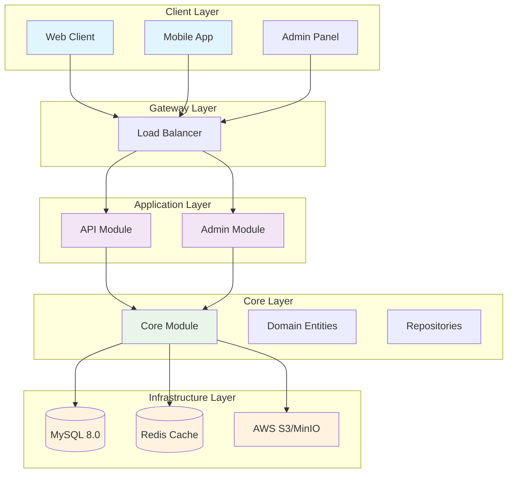

# ECom - Enterprise E-Commerce Platform

[](https://openjdk.java.net/projects/jdk/17/)
[](https://spring.io/projects/spring-boot)
[](https://www.mysql.com/)
[](https://redis.io/)
[](LICENSE)

## 📋 프로젝트 개요

ECom은 현대적인 마이크로서비스 아키텍처를 기반으로 구축된 엔터프라이즈급 E-commerce 플랫폼입니다. Spring Boot 3.x와 Java 17을 사용하여 개발되었으며, 확장성과 유지보수성을 고려한 멀티모듈 구조로 설계되었습니다.

### 🎯 주요 기능

- **사용자 관리**: JWT 기반 인증/인가 시스템
- **상품 관리**: 카테고리별 상품 관리, 이미지 업로드, 검색 및 필터링
- **장바구니**: 실시간 장바구니 관리 및 세션 유지
- **주문 처리**: 주문 생성, 결제 처리, 주문 추적
- **배송 관리**: 배송주소 관리, 기본 주소 설정
- **관리자 시스템**: 상품, 주문, 사용자 관리

## 🏗️ 기술 스택

### Backend
- **Framework**: Spring Boot 3.4.3, Spring Security, Spring Data JPA
- **Language**: Java 17
- **Build Tool**: Gradle 8.x
- **Authentication**: JWT (jjwt 0.11.5)
- **Query**: QueryDSL 5.0.0
- **Validation**: Spring Boot Starter Validation

### Database & Cache
- **Primary DB**: MySQL 8.0
- **Cache**: Redis (Redisson 3.27.2)
- **Connection Pool**: HikariCP

### File Storage
- **Cloud**: AWS S3
- **Local Development**: MinIO

### DevOps & Infrastructure
- **Containerization**: Docker, Docker Compose
- **Testing**: JUnit 5, Spring Boot Test, H2 (Test DB)

### Additional Libraries
- **JSON Processing**: Gson
- **File Handling**: Commons-IO 2.15.0
- **Code Generation**: Lombok

## 🏛️ 아키텍처



### 멀티모듈 구조

```
ECom/
├── api/                          # API 모듈 (사용자 대상)
│   └── src/main/java/com/example/api/
│       ├── ApiApplication.java
│       ├── core/config/          # API 설정
│       └── module/               # 기능별 모듈
│           ├── auth/             # 인증
│           ├── cart/             # 장바구니
│           ├── order/            # 주문
│           ├── product/          # 상품
│           ├── payment/          # 결제
│           └── shipping_address/ # 배송주소
├── admin/                        # 관리자 모듈
│   └── src/main/java/com/example/admin/
│       ├── AdminApplication.java
│       └── module/
│           └── auth/             # 관리자 인증
├── core/                         # 핵심 모듈 (공통)
│   └── src/main/java/com/example/core/
│       ├── CoreApplication.java
│       ├── config/               # 공통 설정
│       ├── domain/               # 도메인 엔티티
│       ├── dto/                  # 데이터 전송 객체
│       ├── enums/                # 열거형
│       ├── exception/            # 예외 처리
│       ├── model/                # 응답 모델
│       └── utils/                # 유틸리티
├── docker-compose.yml            # 로컬 개발 환경
└── build.gradle                  # 빌드 설정
```

## 🚀 빠른 시작

### 필수 조건

- Java 17+
- Docker & Docker Compose
- Gradle 8.x+

### 개발 환경 설정

1. **저장소 클론**
```bash
git clone https://github.com/your-repo/ECom.git
cd ECom
```

2. **인프라 서비스 시작**
```bash
docker-compose up -d
```

3. **애플리케이션 빌드 및 실행**
```bash
# Core 모듈 빌드
./gradlew :core:build

# API 서버 실행
./gradlew :api:bootRun

# 관리자 서버 실행 (별도 터미널)
./gradlew :admin:bootRun
```

4. **서비스 확인**
- API 서버: http://localhost:8080
- 관리자 서버: http://localhost:8081
- MinIO 웹 UI: http://localhost:9001 (minioadmin/minioadmin)

## 📚 API 문서

### 인증 (Authentication)
| Method | Endpoint | Description | Auth Required |
|--------|----------|-------------|---------------|
| POST | `/api/v1/auth/signup` | 회원가입 | ❌ |
| POST | `/api/v1/auth/login` | 로그인 | ❌ |
| POST | `/api/v1/auth/refresh` | 토큰 갱신 | ❌ |

### 상품 (Products)
| Method | Endpoint | Description | Auth Required |
|--------|----------|-------------|---------------|
| GET | `/api/v1/products` | 상품 검색 (카테고리, 가격, 정렬, 페이징) | ❌ |
| GET | `/api/v1/products/{productId}` | 상품 상세 조회 | ❌ |
| POST | `/api/v1/products/image` | 이미지 업로드 | ✅ (ADMIN) |
| POST | `/api/v1/products` | 상품 생성 | ✅ (ADMIN) |
| PUT | `/api/v1/products/{productId}` | 상품 수정 | ✅ (ADMIN) |
| DELETE | `/api/v1/products/{productId}` | 상품 삭제 | ✅ (ADMIN) |

### 장바구니 (Cart)
| Method | Endpoint | Description | Auth Required |
|--------|----------|-------------|---------------|
| GET | `/api/v1/cart` | 장바구니 조회 | ✅ |
| POST | `/api/v1/cart/products` | 상품 추가 | ✅ |
| PUT | `/api/v1/cart/products/{productId}` | 수량 수정 | ✅ |
| DELETE | `/api/v1/cart/products/{productId}` | 상품 삭제 | ✅ |

### 주문 (Orders)
| Method | Endpoint | Description | Auth Required |
|--------|----------|-------------|---------------|
| POST | `/api/v1/order/product` | 상품 주문 | ✅ |
| GET | `/api/v1/order` | 주문 목록 조회 | ✅ |
| GET | `/api/v1/order/{orderId}` | 주문 상세 조회 | ✅ |

### 배송주소 (Shipping Address)
| Method | Endpoint | Description | Auth Required |
|--------|----------|-------------|---------------|
| GET | `/api/v1/shipping-address` | 배송주소 목록 | ✅ |
| POST | `/api/v1/shipping-address` | 배송주소 생성 | ✅ |
| PUT | `/api/v1/shipping-address/{addressId}` | 배송주소 수정 | ✅ |
| PUT | `/api/v1/shipping-address/{addressId}/default` | 기본 주소 설정 | ✅ |
| DELETE | `/api/v1/shipping-address/{addressId}` | 배송주소 삭제 | ✅ |

## 🗄️ 데이터베이스 ERD


## 🔧 개발 가이드

### 코딩 컨벤션

- **Package Naming**: 도메인 중심 패키지 구조 (`module.{domain}.{layer}`)
- **Class Naming**: PascalCase, 의미있는 이름 사용
- **Method Naming**: camelCase, 동사+명사 조합
- **Database**: snake_case 컬럼명, 복수형 테이블명

### 보안 가이드

- JWT 토큰 기반 인증/인가
- 비밀번호 Salt + Hash 저장
- CORS 설정으로 도메인 제한
- SQL Injection 방지 (QueryDSL, JPA 활용)

### 성능 최적화

- **캐싱**: Redis를 활용한 조회 성능 향상
- **Connection Pool**: HikariCP 최적화 설정
- **Query 최적화**: QueryDSL N+1 문제 해결
- **Pessimistic Lock**: 재고 관리 동시성 제어


## 🔍 트러블슈팅

### 자주 발생하는 문제들

1. **Database Connection 실패**
   ```bash
   # Docker 컨테이너 상태 확인
   docker-compose ps
   
   # 로그 확인
   docker-compose logs db
   ```

2. **Redis 연결 실패**
   ```bash
   # Redis 컨테이너 재시작
   docker-compose restart redis
   ```

3. **MinIO 접속 불가**
   ```bash
   # MinIO 컨테이너 확인
   docker-compose logs minio
   ```

4. **JWT 토큰 만료**
   - `/api/v1/auth/refresh` 엔드포인트로 토큰 갱신
